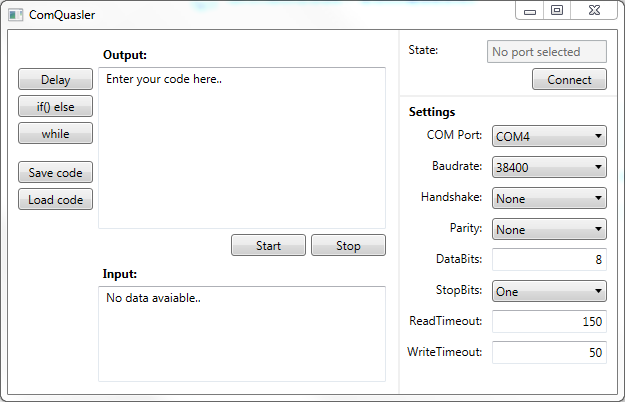

#ComQuasler - Your little debug helper 
Program to write, read and respond to a device connected to a COM-Port. (Windows-only) 
__Written in C# (Visual Studio)__

##Description / Ideas

* __Read__ on COM-Port, __respond__ to it and __write__
* Write scripts in C
* Use Variables
* Use Break Points
* Save and load "C-Scripts"

##GUI

